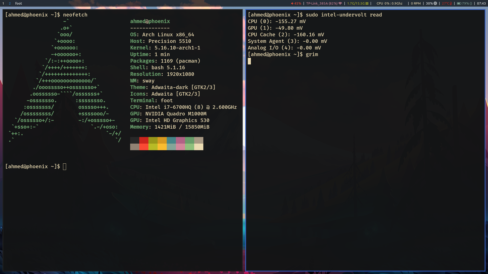

# Undervolting-Dell-laptops
This is a workaround for Dell bios reseting Overclocking lock every time the machine reboots. I have been using this method for months now and it is working fine.
⚠ This Could damage your machine. Do it at your own risk

### 1. Get the addresses of Overclocking/CFG lock
You can follow up [this](https://brendangreenley.com/undervolting-2020-dell-laptops-like-the-vostro-7500-and-more-tips-to-improve-thermals-battery-life-and-speed/) or [this](https://www.reddit.com/r/Dell/comments/fzv599/xps_7590_160_uefi_unlock_undervolting_and_remove/) to get the addresses for the locks for me & I am using Dell precision 5510 it was 0x183 for the Overclocking lock (I don't need the CFG lock but you can get it)

### 2. Testing the address
Download this file [modGRUBShell.efi](https://github.com/datasone/grub-mod-setup_var/releases/download/1.4/modGRUBShell.efi)

1. Format a USB drive to FAT32 on a GUID partition map.
2. Make a folder called `EFI` in the root of the USB.
3. Create folder called `BOOT` inside `EFI`
4. Rename `modGRUBShell.efi` to `bootx64.efi`
5. Boot from usb drive (F12 for BIOS and select your USB drive)
6. Disable Overclocking lock by `setup_var_3 {YOUR ADDRESS} 0x00` for my laptop it is `setup_var_3 0x183 0x00`
7. Reboot
8. Test if you can undervolt using `intel-undervolt` in linux or by `Throttlestop` in Windows

### 3. Annoying part
if the previous step didn't work that means you did something wrong and you got the wrong address (see what others say about your exact model). now if it worked, you will notice that in the next reboot the Overclocking lock is enabled again. we can work around this by disabling it shortly after the boot by using a modified version of GRUB to boot your computer. If you are already using linux, chances are that you already using GRUB so we will just have to patch it. If you are using Windows, you also can install grub but it will be a bit harder (You can search how to do that in the internet). 


### 4. Patching & building Grub for linux
Head to [grub-mod-setup_var by datasone](https://github.com/datasone/grub-mod-setup_var) and get the latest version & [Patch it](https://github.com/datasone/grub-mod-setup_var#build-notes), DON'T build it yet.
Before building you need to take a backup of `/etc/default/grub` (to have the same configuration as the current)
```
./autogen.sh
./configure --with-platform=efi
make
```

### 5. Installing Grub
make sure to remove the GRUB package from your system (so the package manager wouldn't get confused), in my case `pacman -R grub`. 
now you should `sudo make install`.
if copy the backup you took of `/etc/default/grub` to `/etc/default/`.
Now we need to install grub on the drive. you could follow that up in [Arch wiki](https://wiki.archlinux.org/title/GRUB#UEFI_systems)
in my case, that is what all I had to do
```
sudo grub-install --target=x86_64-efi --efi-directory=/boot/efi --bootloader-id=GRUB
sudo grub-mkconfig -o /boot/grub/grub.cfg
```

### 6. Setting the Overclocking lock
You can try to boot in this stage and test if the patch exist by pressing `c` when grup shows up and typing `setup_var_3`. If it exist, you can proceed to the final step and is setting `setup_var_3 {YOUR oVERCLOCKING LOCK ADDRESS} 0x0` in `/etc/grub.d/40_custom`.
for me `/etc/grub.d/40_custom` looks like
```
#!/bin/sh
exec tail -n +3 $0
setup_var_3 0x183 0x0
# This file provides an easy way to add custom menu entries.  Simply type the
# menu entries you want to add after this comment.  Be careful not to change
# the 'exec tail' line above.
```
and you need to run this command again `sudo grub-mkconfig -o /boot/grub/grub.cfg`

### 7. Undervolt your machine
use your favourite tool to undervolt your laptop

